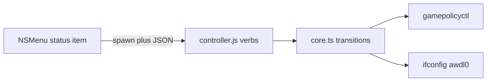

# Game Mode Bar

Game Mode Bar is a native macOS menu-bar policy toggle. A Swift AppKit accessory app spawns a Bun CLI; JSON on stdout is the only IPC. No Electron. The master control is **Toggle → Game Mode+**; individual rows set **macOS Game Mode** and **No AirDrop** (AWDL down).

## What we never compromise on

### 1. Native AppKit, not Electron

The running product is `build/Game Mode Bar.app` (bundle id `dev.kytix.gamemode-bar`).

### 2. Standard NSMenu on the status item

Settings is an `NSMenu` submenu. No `NSPopover`, SwiftUI panel, or custom chrome unless the user explicitly asks.

### 3. Least privilege, reversible policy

One exact sudoers rule for `ifconfig awdl0 up/down` only, validated by visudo. Transitions roll back on failure. This is a policy toggle, not an FPS patch, and must not grow extra root powers.

### 4. The live menu-bar app is the product

After Swift UI, `src/controller.ts`, `src/core.ts`, or build scripts change, finish with `bun run install:local`. `build:debug` is not a substitute for replacing what the user is actually running.

## A note from kytix

I like ambitious ideas, simple systems, and software that feels obvious. Do not preserve complexity just because it already exists. Do not introduce machinery because it looks architecturally impressive. Understand the real constraint, then fight for the smallest model that makes the correct behavior unsurprising.

Channel both "measure twice, cut once" and YAGNI. Fight scope creep. Try to honor the dev's intent in both a minimal and realistic fashion.

The rest of this document is meant to help you navigate the codebase and make changes effectively. Think of these instructions less as hard rules, more as good defaults. The developer's preferences should be able to override anything here.

Most work on this repo happens through agents on the same machine that runs the menu-bar app. Be careful about privileged setup, killing the wrong process, or leaving the user on a stale binary.

## A small glossary

We need to be on the same page with terminology. When communicating, use this language:

- **you** means the agent reading this file and changing Game Mode Bar.
- **we, us, and maintainers** mean the people building Game Mode Bar. These are who you are talking to now.
- **user** means the person running Game Mode Bar from the menu bar.
- **Game Mode Bar** is the product and app name.
- **Game Mode+** is the master toggle brand in the menu (Enable/Disable Game Mode+).
- **Game Mode** (row) means macOS Game Mode policy via `gamepolicyctl` (`on` or `auto`).
- **No AirDrop** means AWDL **down**; the row shows On when AWDL is down, which is inverted from `ifconfig` wording.
- **shell** is `src/native/GameModeBar.swift` (status item, NSMenu, spawn Bun).
- **controller** is `src/controller.ts`, bundled as `Resources/controller.js`, argv verbs and JSON stdout.
- **core** is `src/core.ts` (state, transitions, sudoers install, rollback).
- **authorization** means passwordless `sudo -n ifconfig awdl0` succeeds on probe, not merely that a sudoers file exists on disk.
- **live app** means `build/Game Mode Bar.app`, not `./build/debug/GameModeBar` alone.

The local clone folder may be named `moonlight-mode`; GitHub and the product are **gamemode-bar** / **Game Mode Bar**. "Moonlight" in the README is a streaming use case, not the app name.

## The three ways to hurt yourself

1. **Stale or wrong binary.** Do not stop at `bun run build:debug` and call it done. Do not open leftover apps in `build/` (for example historical `Moonlight Mode.app` or `Ninja Mode.app`). After native, controller, core, or build script changes, run `bun run install:local`, which rebuilds the `.app`, quits by bundle id and `pkill -x GameModeBar`, then `open`s the new app. Do not use `pkill -f` on path or worktree strings; other dev processes may match.
2. **Privileged surfaces.** Do not broaden `sudoersRule` in `src/core.ts`, skip `visudo`, or casually run `setup` / Check Permissions → Authorize (real macOS admin dialog). Do not treat authorization as "the sudoers file is present"; tests assert the file can be absent while the probe still passes.
3. **Inverted or one-surface semantics.** The master toggle uses `anyFeatureOn`: if either row is on, the next master action is Disable. `allAvailableOn` is used in tests only; do not wire it into production master logic. Game Mode is set with `on` or `auto`, not a simple off. Full Xcode (not Command Line Tools alone) provides `gamepolicyctl`. Without Xcode, the Game Mode row is disabled but the master toggle can still change AWDL.

## Hit every surface

The most common defect here is a change that works on the path you tested and is missing everywhere else. Before calling UI or behavior work done, walk this list and say which entries applied:

- **Entry points.** Master toggle, Game Mode row, No AirDrop row, Settings → Check Permissions…, status-item icon and tooltip.
- **Layers.** Swift decodes the same JSON shape the controller emits; controller verbs are `status`, `setup`, `toggle`, `set-game`, `set-awdl`; core owns transitions and rollback.
- **Polarity.** `gameModeChecked` and `noAirDropChecked` in the menu must stay aligned with `gamepolicyctl` and `ifconfig awdl0`.
- **Packaging.** If version or bundle metadata changes: `package.json` → `scripts/sync-version.ts` → `src/native/Info.plist` on build. Do not hand-edit `Casks/gamemode-bar.rb` around a release tag; the Release workflow bumps the cask on `main`.
- **Docs.** User-visible copy belongs in `.github/readme.source.md`, not in generated aura blocks inside `README.md`.
- **Reverse states.** Every enable path needs a disable path and visible state; failed transitions should restore the previous setting.

## Local install

- `bun run install:local` is the same as `bun run dev`. Use it after Swift, controller, core, or build script changes, before ending the task.
- The app still requires Bun at runtime (`GAME_MODE_BAR_BUN`, `~/.bun/bin`, Homebrew, or `PATH`). Override tool paths with `GAME_MODE_BAR_*` env vars (see `src/core.ts`).
- `bun run build:debug` produces `build/debug/GameModeBar` and `controller.js` only; use it when the user explicitly wants the raw debug binary, not as the default finish step.

## Verifying

- Smallest proof for core logic: `bun test` (only `test/core.test.ts` today).
- Normal local gate for this repo: `bun run check` (tests, Biome, `swiftc -typecheck` on the Swift shell). This is not a monorepo; running check here is appropriate unlike T3 Code's "never run the full suite locally."
- After UI, native, controller, or build-script changes: `bun run install:local`, then exercise the live menu. CI does not cover Swift UI, `installAuthorization` / osascript, controller argv wiring, or install/release scripts.
- Do not "fix" the intentional test quirk: `set-game on` can succeed on exit 0 even if live status output still reads off.

## Pull requests and versioning

- Never open a PR or commit unless the developer explicitly asks.
- Conventional Commits; husky and commitlint **validate** message shape on `commit-msg` only. They do **not** bump semver.
- To cut a release: `bun run release` (standard-version, then `sync-version` and an amend of `src/native/Info.plist`; `--no-verify` on that amend is intentional). Push the generated `v0.x.y` tag. CI builds the unsigned ad-hoc zip, publishes a GitHub prerelease, and bumps the Homebrew cask on `main`.

## Documentation

Most code changes need no documentation change. Agents can read the source.

- If user-facing copy or the readme-aura requirements card changes, edit `.github/readme.source.md` and run `bun run readme:build`, or rely on `.github/workflows/readme-aura.yml` on push to that file.
- Do not hand-edit hashed `readme-aura-component-0-*.svg` assets expecting them to stick.
- Do not import parent **shadPS4 / Bloodborne / BBLauncher** agent instructions from a sibling repo; they describe a different workspace.

## How it works

The shell shows an accessory status item with an `NSMenu`. On refresh or user action it spawns Bun with `controller.js` and a verb; the controller calls into core, which reads AWDL via `ifconfig`, Game Mode via `gamepolicyctl` when Xcode is available, and applies `toggle` or `set-*` with rollback on failure. One-time No AirDrop authorization installs a visudo-checked rule through `osascript` into `/etc/sudoers.d/gamemode-bar-awdl`.

## Where code lives

- `src/native/GameModeBar.swift` - AppKit shell, menu, permissions UI, Bun spawn.
- `src/controller.ts` - CLI entry; bundled into the app as `Resources/controller.js`.
- `src/core.ts` - System state, prerequisites, sudoers install, toggles and rollback.
- `scripts/build.ts` - debug binary or full `.app` assembly and ad-hoc codesign.
- `scripts/install-local.ts` - rebuild, quit running app, launch `build/Game Mode Bar.app`.
- `scripts/sync-version.ts` - align `Info.plist` with `package.json` on build.
- `scripts/update-cask.ts` - version and sha256 for `Casks/gamemode-bar.rb` (Release CI).
- `test/core.test.ts` - core and auth probe behavior with fakes.
- `Casks/gamemode-bar.rb` - in-repo Homebrew cask; bump via release automation, not drive-by edits.
- `.github/readme.source.md` - source for generated `README.md`.

## Taste

- Keep transition complexity in core; the Swift shell stays a thin JSON-driven menu.
- Biome uses tabs; TypeScript is strict; Swift is a single AppKit file unless the task clearly needs otherwise.
- Comments explain non-obvious usage (for example master toggle uses `anyFeatureOn`, not test-only `allAvailableOn`).
- If a rule here fights the task in front of you, say so loudly and get a human sign-off before breaking it.

## Additional tips

- Security matters for sudoers; do not widen the rule or add entitlements "just in case."
- Do not verify with GUI automation unless the user explicitly agrees; manual menu check after `install:local` is usually enough.
