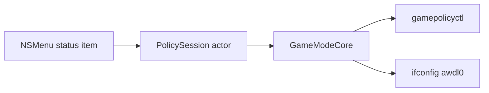

# Game Mode Bar

Game Mode Bar is a native macOS menu-bar policy toggle. A Swift AppKit accessory app links **GameModeCore** directly for policy reads and transitions. No Electron, no Bun, no JavaScript IPC. The master control is **Toggle → Game Mode+**; individual rows set **macOS Game Mode** and **No AirDrop** (AWDL down).

## What we never compromise on

### 1. Native AppKit, not Electron

The running product is `build/Game Mode Bar.app` (bundle id `dev.kytix.gamemode-bar`).

### 2. Standard NSMenu on the status item

Settings is an `NSMenu` submenu. No `NSPopover`, SwiftUI panel, or custom chrome unless the user explicitly asks.

### 3. Least privilege, reversible policy

One exact sudoers rule for `ifconfig awdl0 up/down` only, validated by visudo. Transitions roll back on failure. This is a policy toggle, not an FPS patch, and must not grow extra root powers.

### 4. The live menu-bar app is the product

After Swift shell, GameModeCore, or build scripts change, finish with `scripts/install-local.sh`. A raw `swift build` binary is not a substitute for replacing what the user is actually running.

## A note from kytix

I like ambitious ideas, simple systems, and software that feels obvious. Do not preserve complexity just because it already exists. Do not introduce machinery because it looks architecturally impressive. Understand the real constraint, then fight for the smallest model that makes the correct behavior unsurprising.

Channel both "measure twice, cut once" and YAGNI. Fight scope creep. Try to honor the dev's intent in both a minimal and realistic fashion.

The rest of this document is meant to help you navigate the codebase and make changes effectively. Think of these instructions less as hard rules, more as good defaults. The developer's preferences should be able to override anything here.

Most work on this repo happens through agents on the same machine that runs the menu-bar app. Be careful about privileged setup, killing the wrong process, or leaving the user on a stale binary.

## A small glossary

- **you** means the agent reading this file and changing Game Mode Bar.
- **we, us, and maintainers** mean the people building Game Mode Bar.
- **user** means the person running Game Mode Bar from the menu bar.
- **Game Mode Bar** is the product and app name.
- **Game Mode+** is the master toggle brand in the menu (Enable/Disable Game Mode+).
- **Game Mode** (row) means macOS Game Mode policy via `gamepolicyctl` (`on` or `auto`).
- **No AirDrop** means AWDL **down**; the row shows On when AWDL is down, which is inverted from `ifconfig` wording.
- **shell** is `Sources/GameModeBar/` (status item, NSMenu, `PolicySession` calls).
- **GameModeCore** is `Sources/GameModeCore/` (state, transitions, sudoers install, rollback).
- **PolicySession** is the `actor` that serializes menu refresh and user actions against `ifconfig` / `gamepolicyctl`.
- **authorization** means passwordless `sudo -n ifconfig awdl0` succeeds on probe, not merely that a sudoers file exists on disk.
- **live app** means `build/Game Mode Bar.app`, not `.build/debug/GameModeBar` alone.

The local clone folder may be named `moonlight-mode`; GitHub and the product are **gamemode-bar** / **Game Mode Bar**.

## The three ways to hurt yourself

1. **Stale or wrong binary.** After shell, GameModeCore, or build script changes, run `scripts/install-local.sh`, which rebuilds the `.app`, quits by bundle id and `pkill -x GameModeBar`, then `open`s the new app. Do not use `pkill -f` on path or worktree strings.
2. **Privileged surfaces.** Do not broaden `sudoersRule` in GameModeCore, skip `visudo`, or casually run Check Permissions → Authorize (real macOS admin dialog). Tests assert the sudoers file can be absent while the probe still passes.
3. **Inverted or one-surface semantics.** The master toggle uses `anyFeatureOn`. `allAvailableOn` is test-only. Game Mode is set with `on` or `auto`, not a simple off. Without Xcode, the Game Mode row is disabled but the master toggle can still change AWDL.

## Hit every surface

- **Entry points.** Master toggle, Game Mode row, No AirDrop row, Settings → Check Permissions…, status-item icon and tooltip.
- **Layers.** Shell calls `PolicySession`; core owns transitions and rollback.
- **Polarity.** `gameModeChecked` and `noAirDropChecked` in the menu must stay aligned with `gamepolicyctl` and `ifconfig awdl0`.
- **Packaging.** Version source is `Packaging/Info.plist`. Do not hand-edit `Casks/gamemode-bar.rb` around a release tag; Release CI bumps the cask on `main`.
- **Docs.** User-visible copy belongs in `.github/readme.source.md`, not in generated aura blocks inside `README.md`.
- **Reverse states.** Every enable path needs a disable path; failed transitions should restore the previous setting.

## Local install

- `scripts/install-local.sh` rebuilds `build/Game Mode Bar.app`, quits the running app, and launches it. Use after shell, GameModeCore, or build script changes.
- Override tool paths with `GAME_MODE_BAR_*` env vars (see `Sources/GameModeCore/Types.swift`).

## Verifying

- Core logic: `scripts/check.sh` (`swift test`).
- After UI or packaging changes: `scripts/install-local.sh`, then exercise the live menu.
- Do not "fix" the intentional test quirk: `set-game on` can succeed on exit 0 even if live status output still reads off.

## Pull requests and versioning

- Never open a PR or commit unless the developer explicitly asks.
- Bump `CFBundleShortVersionString` and `CFBundleVersion` in `Packaging/Info.plist`, tag `v0.x.y`, push the tag. Release CI checks the tag matches the plist, builds, publishes a prerelease zip, and bumps the Homebrew cask.

## Documentation

- Human contributor tone: [CONTRIBUTING.md](CONTRIBUTING.md).
- Readme source: `.github/readme.source.md` (run readme-aura workflow or `readme-aura` locally if the requirements card changes).
- Do not import parent **shadPS4 / Bloodborne / BBLauncher** agent instructions from a sibling repo.

## How it works

## Where code lives

- `Sources/GameModeBar/` — AppKit shell (`AppDelegate`, `StatusMenu`, `PermissionsPrompt`).
- `Sources/GameModeCore/` — policy engine and `PolicySession`.
- `Packaging/Info.plist`, `Packaging/icon.png` — bundle metadata and icon source.
- `scripts/build-app.sh`, `scripts/install-local.sh`, `scripts/check.sh`, `scripts/update-cask.sh`.
- `Tests/GameModeCoreTests/` — Swift Testing port of former `core.test.ts`.
- `install.sh` — curl pipe installer (also published via GitHub Pages).
- `Casks/gamemode-bar.rb` — in-repo Homebrew cask.

## Taste

- Keep transition complexity in GameModeCore; the shell stays thin.
- Swift package uses language mode 5 for the AppKit executable target.
- Comments explain non-obvious usage (for example master toggle uses `anyFeatureOn`).

## Additional tips

- Security matters for sudoers; do not widen the rule or add entitlements "just in case."
- Do not verify with GUI automation unless the user explicitly agrees.
