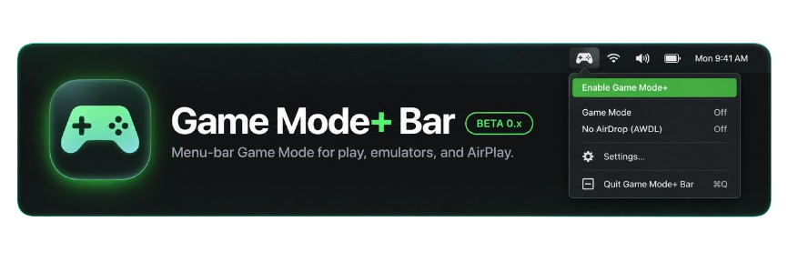
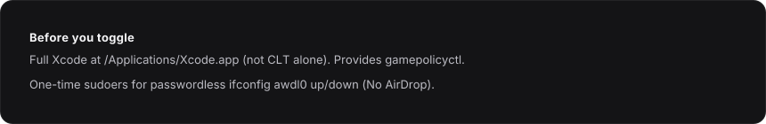

Native macOS menu-bar app. No Electron. **Toggle → ON/OFF** is the master switch. Individual rows tune **macOS Game Mode** and **No AirDrop** (AWDL down). Open **Settings…** and use **Check Permissions…** for Xcode and sudoers setup.

## Why use it

Apple’s automatic Game Mode is hit-or-miss. It often skips emulators, streamers, and full-screen apps that still need the policy boost. Game Mode Bar forces the same path macOS uses when it *does* engage Game Mode, from a persistent menu-bar control.

It can help reduce stutter and frame pacing issues when:

* **AirPlaying** video or games to a TV (AWDL traffic fighting the same Wi‑Fi)
* **Emulators and PC/console streaming** (shadPS4, Moonlight, other full-screen play)
* **Apps macOS doesn’t treat as games**, even when you’re on a controller

Results vary by Mac, network, and workload. This is a policy toggle, not a magic FPS patch.

## Requirements

The app checks these for you. Use **Settings → Check Permissions…** to fix gaps.



## Develop

```sh
bun install
bun run check
bun run build:debug
./build/debug/GameModeBar
bun run build   # Game Mode Bar.app
```

Bun resolves from `GAME_MODE_BAR_BUN`, `~/.bun/bin`, Homebrew, or `PATH`. Override tool paths with `GAME_MODE_BAR_*` env vars (see `src/core.ts`).

## Releases (beta)

* Conventional Commits on `main`. Maintainers tag `v0.x.y` when a beta binary is ready.
* CI builds an unsigned ad-hoc `.app` zip attached to GitHub **prereleases**.
* Not at 1.0 yet.

## Install

Homebrew (beta, in-repo tap):

```sh
brew tap KyTiXo/gamemode-bar https://github.com/KyTiXo/gamemode-bar.git
brew install --cask gamemode-bar
```

Requires [Bun](https://bun.sh) (pulled in by the cask). Full Xcode and one-time sudoers setup still apply — use **Settings → Check Permissions…** after install.

Or download the latest prerelease zip from [GitHub Releases](https://github.com/KyTiXo/gamemode-bar/releases).

MIT. See [LICENSE](LICENSE).
