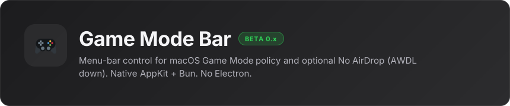

Native macOS menu-bar app. Use **Set Up Game Mode…** and **Set Up No AirDrop…** in the menu to check prerequisites before toggling.


## Requirements

The app checks these for you; use the setup menu items to fix gaps.


## Develop

```sh
bun install
bun run check
bun run build:debug
./build/debug/GameModeBar
bun run build   # Game Mode Bar.app
```

Bun resolves from `GAME_MODE_BAR_BUN`, `~/.bun/bin`, Homebrew, or `PATH`. Override tool paths with `GAME_MODE_BAR_*` env vars (see `src/core.ts`).

## Releases (beta)

* Conventional Commits on `main`; maintainers tag `v0.x.y` when a beta binary is ready.
* CI builds an unsigned ad-hoc `.app` zip attached to GitHub **prereleases**.
* Not at 1.0 yet.

## Install (future)

Homebrew cask planned (`brew install --cask gamemode-bar`). Until then, download the latest prerelease from GitHub Releases.

MIT — see [LICENSE](LICENSE).
