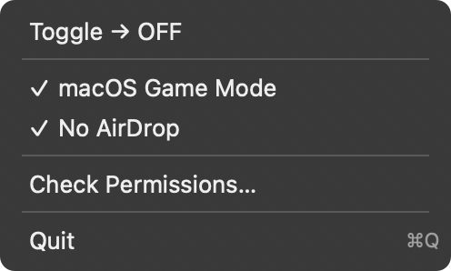

```aura width=860 height=180
<div style={{
  width: '100%', height: '100%', background: 'linear-gradient(135deg, #1c1c1e 0%, #2c2c2e 100%)',
  display: 'flex', alignItems: 'center', fontFamily: 'Inter',
  position: 'relative', overflow: 'hidden', borderRadius: 16,
  border: '1px solid rgba(255,255,255,0.08)'
}}>
  <div style={{
    position: 'absolute', left: 40, top: 40, width: 72, height: 72,
    borderRadius: 18, background: 'rgba(255,255,255,0.06)',
    display: 'flex', alignItems: 'center', justifyContent: 'center',
    fontSize: 36
  }}>🎮</div>
  <div style={{ display:'flex', flexDirection:'column', marginLeft:132, gap:6, zIndex: 10 }}>
    <div style={{ display:'flex', alignItems:'center', gap:12 }}>
      <span style={{ fontSize:34, fontWeight:800, color:'#f5f5f7', letterSpacing:'-0.5px' }}>Game Mode Bar</span>
      <span style={{
        display:'flex', padding:'4px 10px', borderRadius:999,
        background:'rgba(48,209,88,0.18)', border:'1px solid rgba(48,209,88,0.45)',
        color:'#30d158', fontSize:11, fontWeight:700, letterSpacing:'0.6px'
      }}>BETA 0.x</span>
    </div>
    <div style={{ display:'flex', fontSize:15, color:'rgba(235,235,245,0.72)', maxWidth:620, lineHeight:1.45 }}>
      Menu-bar control for macOS Game Mode policy and optional No AirDrop (AWDL down). Native AppKit + Bun. No Electron.
    </div>
  </div>
</div>
```

Native macOS menu-bar app. **Toggle → ON/OFF** at the top reflects the next master toggle; **Check Permissions…** at the bottom verifies Xcode and No AirDrop (AWDL) prerequisites.



_Regenerate after menu changes: `bun run readme:assets` (uses the same labels as the app)._

## Requirements

The app checks these for you; use **Check Permissions…** to fix gaps.

```aura width=860 height=140
<div style={{
  width: '100%', height: '100%', background: '#141416',
  display: 'flex', flexDirection: 'column', justifyContent: 'center',
  padding: '0 32px', borderRadius: 14, border: '1px solid rgba(255,255,255,0.07)',
  fontFamily: 'Inter', gap: 8
}}>
  <div style={{ display: 'flex', fontSize: 13, fontWeight: 700, color: '#f5f5f7', letterSpacing: '0.3px' }}>Before you toggle</div>
  <div style={{ display: 'flex', fontSize: 13, color: 'rgba(235,235,245,0.78)', lineHeight: 1.5 }}>
    Full Xcode at /Applications/Xcode.app (not CLT alone).
  </div>
  <div style={{ display: 'flex', fontSize: 13, color: 'rgba(235,235,245,0.78)', lineHeight: 1.5 }}>
    One-time sudoers for passwordless ifconfig awdl0 up/down (No AirDrop).
  </div>
</div>
```

## Develop

```sh
bun install
bun run check
bun run build:debug
./build/debug/GameModeBar
bun run build   # Game Mode Bar.app
```

Bun resolves from `GAME_MODE_BAR_BUN`, `~/.bun/bin`, Homebrew, or `PATH`. Override tool paths with `GAME_MODE_BAR_*` env vars (see `src/core.ts`).

## Releases (beta)

- Conventional Commits on `main`; maintainers tag `v0.x.y` when a beta binary is ready.
- CI builds an unsigned ad-hoc `.app` zip attached to GitHub **prereleases**.
- Not at 1.0 yet.

## Install (future)

Homebrew cask planned (`brew install --cask gamemode-bar`). Until then, download the latest prerelease from GitHub Releases.

MIT — see [LICENSE](LICENSE).
